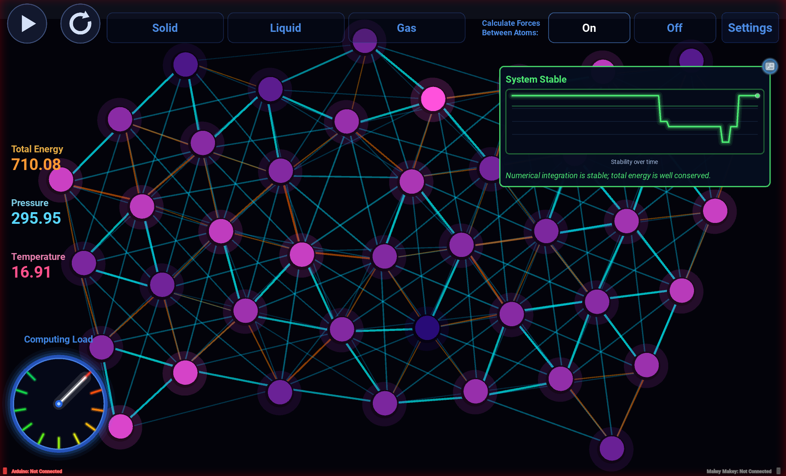

# MD-Kivy

A 2D molecular dynamics sandbox for education, written in Python with Kivy.
Molecules interact through a Lennard-Jones potential; you can tune the
parameters, toggle the forces, and watch how the motion changes. There is a
single-player sandbox and a two-player battle mode we use at outreach events.
Built for a large touchscreen, but it runs fine on a laptop.



## Running it

```bash
git clone https://github.com/AnastasiiaBerezovska/MD-Kivy.git
cd MD-Kivy
python3 -m venv venv
source venv/bin/activate
pip install -r requirements.txt
python main.py
```

Run from the repository root so fonts and graphics resolve.

Arduino input is optional. Edit the port in `run_wired.sh` (USB) or the IP in
`run_wireless.sh` (Wi-Fi bridge) and launch with those instead. Sketches and
wiring notes are in [hardware/](hardware/).

## Layout

```
main.py                entry point
mdkivy/simulation/     physics: LJ forces, integrators, collisions
mdkivy/screens/        landing, game, battle, leaderboard screens
mdkivy/inputs/         Arduino and Makey Makey input
mdkivy/widgets/        sliders, gauges, graphs
hardware/              Arduino sketches and setup notes
docs/                  project website and figures
tools/                 physics benchmark
```

## Performance

`python3 tools/bench_physics.py` times the physics step. Cost grows as
O(N^2) with molecule count; on an i7-1250U the 30 Hz loop keeps up to
roughly 300 molecules with forces enabled.

## License

MIT - see [LICENSE](LICENSE).
